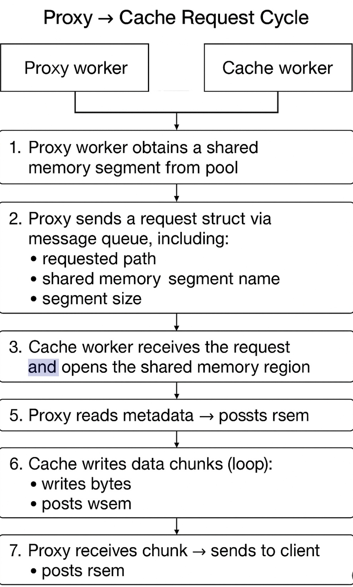

# Project README file

https://stackoverflow.com/questions/8465006/how-do-i-concatenate-two-strings-in-c

Initially, I tried using a HEAD request to get the content length from the server before downloading the file. My idea was to send the GF_OK header with the known length and then perform a normal GET request to stream the body. For some files, CURL returned a content length of 0, or the reported length didn’t match the actual number of bytes received.

Because of these problems, I abandoned the HEAD request approach. Instead, I switched to downloading the full file into memory first, storing it in a dynamically resizing buffer. Each time libcurl received a chunk of data, the callback function would calculate the actual size of that chunk, expand the buffer using realloc, copy the new data into place, and update the total size. By the end of the download, I had a contiguous block of memory containing the entire file and an exact byte count. With this information, I could send a GF_OK header that matched the actual size of the data. After sending the header, I streamed the data to the client in a loop, tracking how many bytes were successfully sent in case gfs_send only wrote a portion at a time. 
Testing.

I know this is not the best approach for this program but since it's already passing the gradescope. I moved to part 2

I used detailed logging to keep track of the number of bytes that were being sent. I checked that the provided client and that the downloaded files matched the served files exactly.  

I also ran tests using gfmetrics and all requests completed successfully.

# Part 2

I implemented a shared memory segment pool on the proxy side. Each worker thread acquires a segment from the pool when a request begins and returns it when the transfer completes. This avoids repeated calls to shm_open() and reduces overhead during high-traffic workloads. Each segment includes its own synchronization primitives (wsem, rsem), enabling independent communication between individual proxy–cache request pairs.

The cache receives requests through a message queue and uses the segment name passed in the request to open the corresponding shared memory region. From there, the communication protocol is simple:
	1.	Proxy sends request via MQ
	2.	Cache writes metadata into shared memory and signals wsem
	3.	Proxy reads metadata, signals rsem
	4.	Cache writes next chunk, signals wsem
	5.	Proxy sends chunk and signals rsem
This loop continues until all bytes are delivered.

## Control Flow 

# Testing

- I used print statements to check:
    - Proxy threads correctly send commands to the cache.
    - The cache writes data into shared memory segments.
    - The proxy read and forward data to the client without corruption.
    - File-not-found, errors, and success cases follow the expected protocol.
I kept track of the number of bytes accross the the processes 
I tested failure modes by sending termination signals and observing resource cleanup. 
I Used multiple proxy and cache threads to confirm that shared memory segments, semaphores, and MQ interactions are independent and race-free.

- **Memory checks:**  I used Valgrind. 
- **Python testing Suite:**:
- Used the testing suite to check for any errors. 

### Other C 
- [Message Queue](https://www.softprayog.in/programming/interprocess-communication-using-posix-message-queues-in-linux)
- [Shared Memory](https://www.softprayog.in/programming/interprocess-communication-using-posix-shared-memory-in-linux)
- [File size](https://stackoverflow.com/questions/238603/how-can-i-get-a-files-size-in-c)
